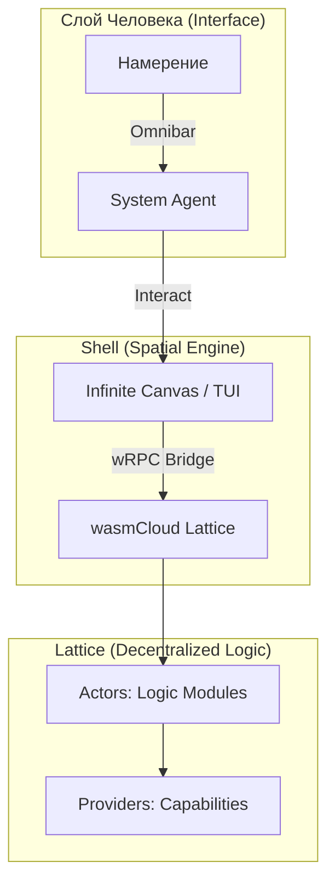

# The Last OS: Общее описание (Vision)

> "Эра 'Приложений' закончилась. Началась эра 'Потоков Работы' (Workflows)."

## 1. Видение
**The Last OS** — это экспериментальная операционная среда написания и выполнения кода, стирающая границу между пользователем и ИИ. Это не просто "оболочка для чат-бота", а полноценный пространственный интерфейс (Spatial UI), где ИИ является системным процессом, способным управлять окнами, создавать контент и манипулировать окружением.

Эстетика: **Post-Cyberpunk / Industrial**. Строгие линии, моноширинные шрифты (JetBrains Mono), темная палитра, "сырые" данные.

## 2. Смена Парадигмы
Мы строим **Децентрализованное Ядро** для мира пост-софта на базе стандарта **Zero-Web2**.
**Это "Unity для ИИ-приложений" в мире Web3.**
В этом мире люди не "устанавливают приложения", они "вплетают новые возможности" в свою систему (Digital Citadel) через Lattice, используя только суверенные протоколы.

### Концепция: Lattice Projection
Ядро tLOS — это физический движок, который визуализирует распределенную логику Актёров на бесконечный холст.

### Ключевые Возможности:
1.  **Пространственное Состояние**: Ваши проекты — это здания на карте.
2.  **Autonomous UX**: Вход через Nostr-ключи. Суверенитет данных.
3.  **Generative UI**: Система сама рисует интерфейсы для актёров.

## 3. Пользовательский Опыт
1.  **Вход**: Приземление в личную Цитадель (Base).
2.  **Развитие**: Добавление новых "зданий" (Актёров) через разговор с системой.
3.  **Связи**: Визуальное соединение потоков данных на холсте.
