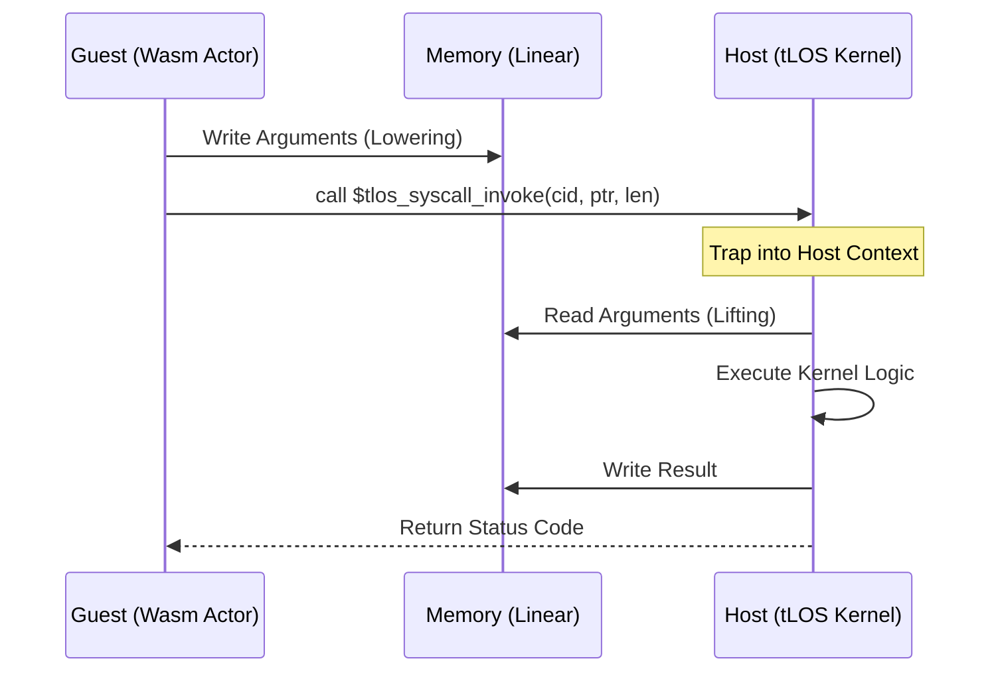

# Syscalls & ABI: The Binary Boundary

Этот документ описывает низкоуровневый бинарный интерфейс (ABI) и механизм системных вызовов (Syscalls) в **The Last OS (tLOS)**. Поскольку tLOS основан на WebAssembly, системные вызовы здесь реализованы как импорты хостовых функций (Host Imports).

---

## 1. Механизм вызова (The Trap Mechanism)
В tLOS системный вызов — это не прерывание процессора (INT 0x80), а переход границы между Wasm-песочницей (Guest) и средой выполнения ядра (Host).

### 1.1. Flowchart вызова

---

## 2. Регистровая спецификация (Calling Convention)
Для повышения производительности мы минимизируем использование линейной памяти для простых вызовов, используя до 6 параметров типа `i64`.

| Регистр (Wasm) | Роль | Описание |
| :--- | :--- | :--- |
| **P0** (i32) | Call ID | Идентификатор функции ядра. |
| **P1..P6** (i64)| Params | Аргументы вызова (указатели или значения). |
| **RET** (i32) | Status | `0` - успех, `>0` - код ошибки. |

---

## 3. Модель Мод (ABI Modes)
tLOS поддерживает два режима работы ABI:

### 3.1. Synchronous Mode (Direct)
Блокирующий вызов. Актёр приостанавливает выполнение до получения результата от ядра. Подходит для атомарных операций с памятью или локальных ресурсов.

### 3.2. Asynchronous Mode (WASI Preview 3)
Основан на **Futures** и **Streams**.
- Вызов возвращает `handle` (индекс в таблице дескрипторов).
- Актёр может использовать `poll` для проверки готовности результата.
- Поддерживает обратную совместимость с `wRPC`.

---

## 4. Спецификация типов (Canonical ABI)
Мы следуем **WebAssembly Canonical ABI** для передачи сложных данных:

1.  **Strings**: Всегда UTF-8. Передаются как пара `(ptr: i32, len: i32)`.
2.  **Lists**: Передаются через выделенный буфер в линейной памяти.
3.  **Variants (Enums)**: Передаются как дискриминант (`i32`) + `union` данных.
4.  **Resources**: Передаются как числовые `i32` индексы в таблице хоста (Capabilities).

---

## 5. Основные Системные Вызовы (Sycall Tables)

| CID | Имя | Описание |
| :--- | :--- | :--- |
| `0x01` | `kv_get` | Чтение из хранилища Sovereign Ledger. |
| `0x02` | `kv_set` | Запись в хранилище (требует подписи). |
| `0x03` | `msg_publish` | Отправка сообщения в Латицу (NATS). |
| `0x04` | `spatial_move` | Обновление координат актёра. |
| `0x05` | `gfx_draw` | Отправка команд отрисовки в WGPU. |

---

## 6. Безопасность и Изоляция
- **Memory Safety**: Ядро проверяет границы `ptr` и `len` перед чтением/записью для предотвращения Out-of-bounds атак.
- **Capability Checks**: Перед выполнением syscall ядро проверяет наличие соответствующих прав в манифесте актёра.
- **Panic Isolation**: Если syscall приводит к ошибке в ядре, паникует только поток обслуживания актёра, а не вся ОС.

---
*Документ соответствует стандартам Wasm C-ABI и спецификации WASI 0.3 (Preview 3).*
