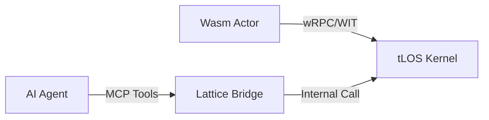

# Kernel API Reference: The Interface Level

Этот документ описывает системные интерфейсы (System Calls) **The Last OS (tLOS)**. tLOS спроектирован как **AI-Native** система, где ядро предоставляет API как для Wasm-актёров (через **wRPC/WIT**), так и для AI-агентов (через **MCP**).

---

## 1. Концепция: Dual-Layer API
Ядро tLOS предоставляет два способа взаимодействия:

1.  **Low-Level (WIT)**: Строго типизированные интерфейсы для Актёров. Прямой доступ к ресурсам Латицы.
2.  **High-Level (MCP)**: Семантические инструменты (Tools) для AI-агентов. Обертка над WIT с текстовыми описаниями.



---

## 2. Основные Интерфейсы (Core Interfaces)

### 2.1. `tlos:spatial/index`
Интерфейс для работы с Quadtree и пространственным холстом.

**WIT Definition:**
```wit
interface index {
    /// Поиск всех объектов в радиусе
    query-radius: func(center: point, radius: f64) -> list<entity-id>;
    
    /// Обновление позиции актёра
    update-position: func(id: entity-id, new-pos: point) -> result<_, error>;
}
```

**MCP Mapping (AI Tool):**
- **Name**: `search_spatial_objects`
- **Description**: "Находит AI-агент или объекты в указанных пространственных координатах."
- **Parameters**: `x`, `y`, `radius`.

---

### 2.2. `tlos:lattice/actor`
Управление жизненным циклом компонентов в Латице.

**WIT Definition:**
```wit
interface actor {
    /// Запуск нового актёра на указанном узле
    spawn: func(image-ref: string, region: option<string>) -> result<actor-id, error>;
    
    /// Получение подписи актёра для верификации
    get-claims: func(id: actor-id) -> claims;
}
```

---

## 3. Модель Безопасности и Capability Providers
В tLOS актёры не имеют прямого доступа к железу. Все вызовы проходят через **Capability Providers**.

- **wasi:http**: Доступ к сети (белый список доменов).
- **tlos:keyvault**: Доступ к Nostr-ключам (требует подписи пользователя).
-   **tlos:painter**: Доступ к WGPU-контексту для отрисовки.

---

## 3.1. Технологический Стек (Runtime Stack)
Ядро реализует концепцию "Физический Движок + Динамическая Глина":
- **Rust (Физика)**: Обеспечивает безопасность памяти, асинхронный рантайм (`tokio`) и высокую производительность системных вызовов.
- **QuickJS / rquickjs (Глина)**: Динамический JS-движок для выполнения логики, сгенерированной ИИ. 
    - *Почему QuickJS?*: Старт контекста <0.3мс (в 60 раз быстрее V8), малый размер (~200КБ) и нативная изоляция памяти для каждого приложения.
- **Wasm (Песочница)**: Использование `wasmCloud` гарантирует, что компоненты изолированы и мобильны (могут перемещаться Cloud <-> Edge).

---

## 4. Рекомендации по Документации (AI-First)
Для поддержания API в актуальном состоянии для AI-агентов:

1.  **Doc-comments as SoT**: Все описания в `.wit` файлах (через `///`) автоматически парсятся и превращаются в описания MCP инструментов.
2.  **Interactive Sandboxes**: Каждый API-интерфейс должен иметь тестовую «песочницу», где агент может проверить вызов перед его выполнением в «боевой» среде.
3.  **JSON-Schema Export**: Ядро автоматически генерирует JSON-схемы для всех WIT-типов данных для упрощения интеграции с LLM.

---
*Документ соответствует стандартам Component Model WIT и спецификации MCP 2025-11-25.*
