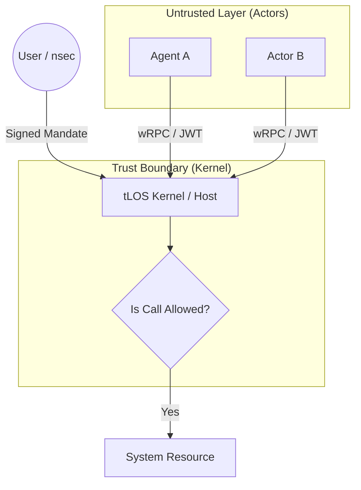

# Security Model: Threat Model & Zero Trust

Этот документ описывает модель безопасности **The Last OS (tLOS)**. Система построена на принципах **Zero Trust (NIST SP 800-207)**, где каждый компонент, агент и пользователь должен непрерывно подтверждать свою идентичность и права (Identity as Key).

---

## 1. Архитектура Безопасности (Security View)
tLOS использует многоуровневую защиту, сочетающую криптографическую идентичность и песочницы Wasm.

### 1.1. Корень Безопасности: JWT & Nostr
Каждый Актёр в системе несет в себе **Embedded JWT**, подписанный ключом разработчика или пользователя (Nostr).
- **Subject**: Публичный ключ актёра.
- **Capabilities**: Список разрешенных WIT-интерфейсов (например, `tlos:ledger/read`).
- **Chain of Trust**: Верификация подписи JWT происходит при каждой попытке запуска или вызова.

---

## 2. Threat Model (STRIDE)

| Угроза | Описание | Механизм защиты в tLOS |
| :--- | :--- | :--- |
| **Spoofing** | Подмена актёра или узла. | **Identity as Key**: Использование Ed25519 и JWT для верификации каждого субъекта. |
| **Tampering** | Изменение кода Wasm на лету. | **Content Addressing**: Все компоненты идентифицируются по хешу (CID). |
| **Repudiation** | Отказ от действий агента. | **Sovereign Ledger**: Все значимые действия подписываются и логируются в Merkle-DAG. |
| **Information Disclosure** | Утечка данных между актёрами. | **Isolation**: Wasm-песочницы имеют раздельное адресное пространство. E2EE шифрование. |
| **Denial of Service** | Потребление всех ресурсов узла. | **Quotas**: Лимиты на CPU/Memory на уровне рантайма Wasmtime. |
| **Elevation of Privilege**| Sandbox escape. | **Capability-based Security**: Доступ к ресурсам только через WIT-интерфейсы. |

---

## 3. AI-Specific Threats (OWASP Top 10 for Agents 2026)
Как AI-native система, tLOS уделяет особое внимание специфическим угрозам для агентов.

1.  **ASI01: Agent Goal Hijack**: Защита через "Intent Capsule" — подписанное пользователем задание, которое агент не может изменить без повторного подтверждения.
2.  **ASI02: Tool Misuse**: Гранулярные разрешения для инструментов через WIT-интерфейсы ("Least Agency").
3.  **ASI06: Context Poisoning**: Изоляция оперативной памяти агента и валидация входящих данных как `untrusted`.

---

## 4. Принципы "Zero Trust" в tLOS
1.  **Deny-by-Default**: Любой доступ к сети, файлам или другим актёрам запрещен, пока явно не разрешен в манифесте.
2.  **Continuous Verification**: Права проверяются при каждом системном вызове, а не только при запуске.
3.  **Micro-segmentation**: Каждый актёр — это отдельный сегмент сети с собственными политиками доступа (Lattice Policy).

---

## 5. Модель Согласия (Consent Model)
Пользователь (The Shaper) сохраняет полный контроль:
- **Runtime Approval**: Для критических действий (трата средств, удаление данных) система запрашивает явное подтверждение через Shell.
- **Just-in-Time Permissions**: Разрешения могут выдаваться на время выполнения конкретной задачи.

---

## 6. AI Shields: Интеллектуальные Щиты (Проактивная защита)

В tLOS безопасность не ограничивается пассивными проверками. **AI Shields** — это активный слой защиты, который действует как иммунная система ОС:

1.  **Intent Filtering (Фильтрация намерений)**: Прежде чем команда из Omnibar будет передана агенту, "Щит" анализирует её на наличие скрытых деструктивных намерений или ошибок.
2.  **Behavioral Guardrails**: Если агент начинает выполнять подозрительный цикл действий (например, массовое копирование данных), Щит мгновенно изолирует его и запрашивает подтверждение у Shaper.
3.  **Real-time Audit**: Каждое действие AI-агентов логируется и верифицируется на соответствие изначальному "Мандату" пользователя.
4.  **Security Watchers**: Специализированные системные агенты, которые постоянно "сканируют" пространство на наличие уязвимостей и предлагают улучшения (например, "Обновить ключ Nostr" или "Закрыть доступ к зоне X").

---

---
*Безопасность tLOS — это не стена, а математика подписей.*
