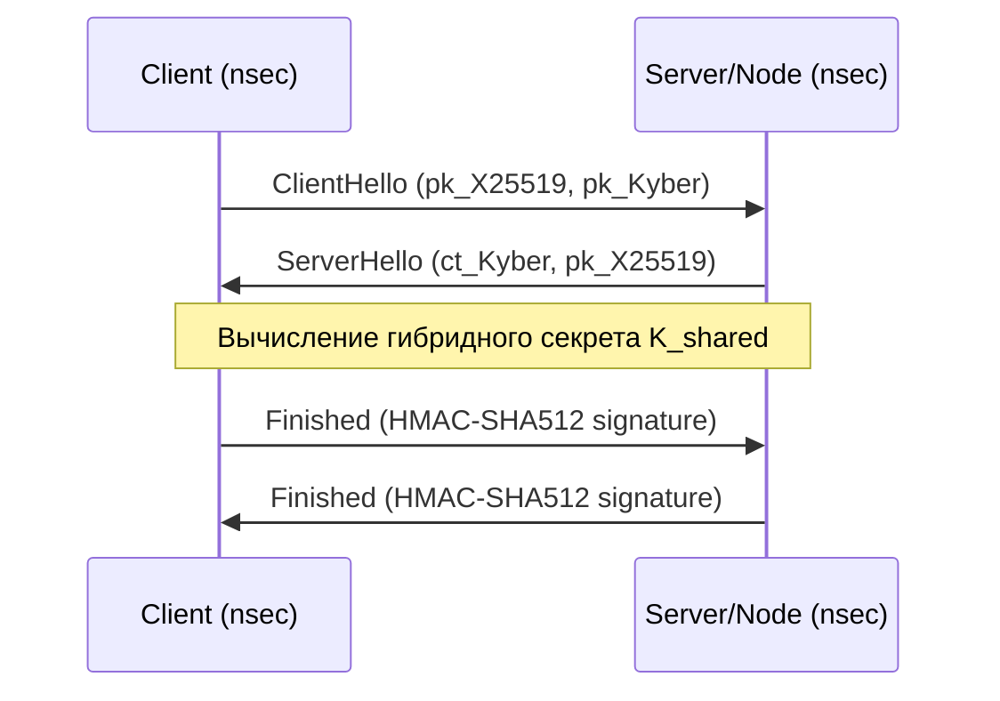

# Cryptography Specs: The Grid Protocol

Этот документ определяет криптографические стандарты и протоколы, обеспечивающие безопасность **The Last OS (tLOS)**. Основной упор сделан на гибридную пост-квантовую защиту (PQC) и суверенное управление ключами.

---

## 1. Стек Примитивов (The Primitive Stack)
Мы следуем принципу "консервативной современности", сочетая проверенные временем алгоритмы с новыми стандартами NIST.

| Задача | Алгоритм | Обоснование |
| :--- | :--- | :--- |
| **Identity / Signing** | Ed25519 (Schnorr) | Высокая производительность, детерминизм, Nostr-совместимость. |
| **Hybrid KEX (Classical)** | X25519 (ECDH) | Индустриальный стандарт, эффективная реализация в Rust. |
| **Hybrid KEX (PQC)** | ML-KEM (Kyber768) | Победитель NIST PQC, оптимальное соотношение размера ключа и скорости. |
| **Symmetric Encryption**| ChaCha20-Poly1305 | Встроенная защита от тайминг-атак (Software-safe). |
| **Hash Function** | SHA-512 / BLAKE3 | Криптографическая стойкость и высокая скорость в Wasm. |

---

## 2. Гибридный Обмен Ключами (Hybrid Key Exchange)
Для защиты от угрозы "Harvest Now, Decrypt Later" мы используем комбинированный метод формирования сессионного ключа.

### 2.1. Математическая нотация
Процесс вывода общего секрета ($K_{shared}$):
1.  Выполняется классический обмен: $S_{ecdh} = X25519(sk_{client}, pk_{server})$.
2.  Выполняется PQC декапсуляция: $S_{pqc} = ML-KEM.Decaps(ct_{server}, sk_{client})$.
3.  Финальный секрет: $K_{shared} = HKDF\text{-}SHA512(ikm = S_{ecdh} \| S_{pqc}, salt = \text{SessionID}, info = \text{"tLOSv1-KEX"})$.

### 2.2. Логика потока (Sequence)

---

## 3. Модель Угроз (Threat Model — STRIDE)
| Угроза (STRIDE) | Описание | Механизм защиты в tLOS |
| :--- | :--- | :--- |
| **Spoofing** | Подмена узла или пользователя. | Аутентификация через Ed25519 (Identity as Key). |
| **Tampering** | Модификация данных в Латице. | AEAD шифрование (Poly1305) и подписи событий. |
| **Information Disclosure** | Перехват данных (в т.ч. квантовый). | Гибридное шифрование X25519 + Kyber. |
| **Repudiation** | Отказ от совершенного действия. | Каждое событие подписано неизменяемым ключом. |

---

## 4. Безопасность реализации (Rust/WASM)
Для предотвращения утечек на уровне памяти и времени выполнения мы устанавливаем следующие требования:

1.  **Constant-Time**: Использование трейтов `subtle` для всех сравнений секретных данных.
2.  **Zeroization**: Обязательное использование крейта `zeroize` для очистки ключей в памяти после использования.
3.  **No `unsafe`**: Минимизация использования `unsafe` блоков в крипто-ядре.
4.  **Formal Verification**: Использование **`libcrux`** (от Cryspen) в качестве основного источника PQC реализации. Весь крипто-код должен быть математически верифицирован (F* toolchain) для исключения логических ошибок и атак по сторонним каналам.

---

## 5. Проблема Энтропии в Wasm
WebAssembly — это изолированная песочница без прямого доступа к аппаратному RNG.
-   **Entropy Bridge**: Ядро запрашивает случайные числа у Shell через WIT-интерфейс.
-   **Implementation**: Shell пробрасывает `crypto.getRandomValues()` (JS) в Wasm-инстанс.
-   **Safety**: Крейт `getrandom` должен быть сконфигурирован с фичей `js` для корректной привязки к API браузера/ноды. Использование `Math.random()` запрещено (паника на этапе рантайма).

---
*Документ соответствует стандартам NIST 2026 и RFC 8032.*
