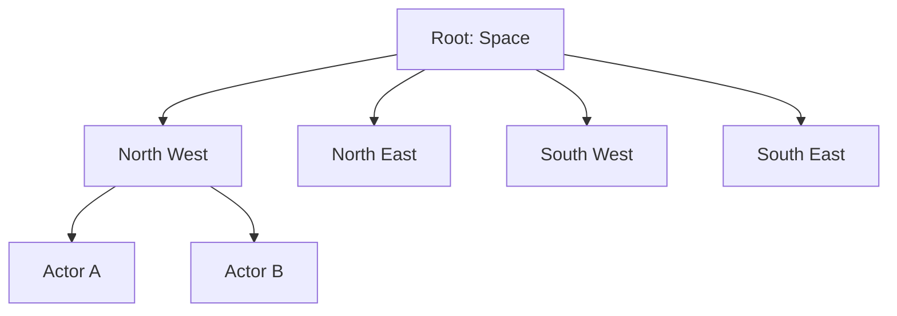

# Data Structures: The Ledger & Spatial Index

Этот документ определяет структуры данных, используемые в **The Last OS (tLOS)** для обеспечения суверенности, синхронизации и пространственной навигации.

---

## 1. Слой Данных: Merkle-DAG & IPLD
tLOS использует контентно-адресуемые структуры данных (IPLD) для гарантии неизменяемости и цепочки владения.

### 1.1. Схема События (IPLD Schema)
Каждое изменение в системе записывается как событие в Merkle-DAG.
```ipld
type Event struct {
  version Int
  timestamp Int
  prev &Event            # Ссылка на предыдущее событие (CID)
  actor_id String        # Ed25519 PubKey автора
  payload Variant {      # Тип данных события
    SpatialUpdate SpatialData
    ActorSpawn ActorInit
    IdentityRotate KeyUpdate
  }
  signature Bytes        # Ed25519 подпись всего блока
}
```

---

## 2. Синхронизация: CRDT (Conflict-free Replicated Data Types)
Для обеспечения работы в условиях разрыва сети (AP-система), глобальное состояние tLOS строится на базе CRDT.

### 2.1. Используемые примитивы
- **LWW-Register (Last-Write-Wins)**: Для метаданных объектов.
- **OR-Set (Observed-Remove Set)**: Для списков установленных приложений и активных узлов.
- **Spatial Grid (G-Counter-based)**: Для инкрементального обновления координат в пространстве.

### 2.2. Логика Слияния (Merge Function)
Математически, состояние Латицы является полурешеткой (Join-Semilattice):
$S_{new} = S_{local} \sqcup S_{remote}$
Слияние всегда детерминировано и не требует централизованного арбитра.

---

## 3. Пространственный Индекс: Distributed Quadtree
Для эффективного поиска объектов на "бесконечном холсте" используется распределенное квадродерево.

### 3.1. Разбиение Пространства (Tessellation)
Пространство делится рекурсивно на 4 квадрата. Каждый лист (leaf) дерева содержит ссылки на CID объектов в этом радиусе.



### 3.2. Шардирование (Sharding)
Узлы Латицы берут на себя ответственность за определенные ветви дерева (Buckets) на основе своего географического или логического расположения. Динамическое разделение (split) происходит при превышении лимита объектов (например, 1000 актёров на один нод).

---

## 4. WIT Интерфейсы (Data Models)
Для взаимодействия между Wasm-компонентами структуры данных описываются в формате `*.wit`.

```wit
record spatial-point {
    x: f64,
    y: f64,
    z: f64,
}

variant entity-state {
    active(spatial-point),
    dormant(string),
    terminated,
}
```

---
*Документ базируется на стандартах IPLD, CRDT (Diamond Types) и WIT Component Model.*
