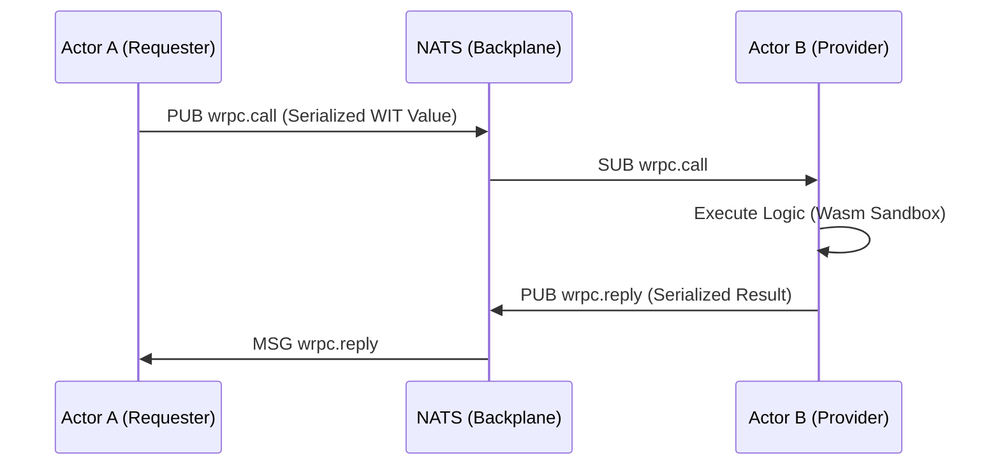

# Network Protocol: The Grid (Lattice)

Этот документ описывает сетевой протокол **The Grid**, обеспечивающий связность, обнаружение сервисов и синхронизацию состояния в **The Last OS (tLOS)**. Протокол построен на базе **wRPC** и **NATS**.

---

## 1. Архитектурный Обзор (C4 Level 2)
tLOS не использует классическую клиент-серверную модель. Вместо этого устройства пользователя и облачные узлы образуют единую **Латицу (Lattice)**.

```mermaid
graph TD
    subgraph "The Lattice (NATS Backplane)"
        NodeA[User Laptop]
        NodeB[Cloud Provider]
        NodeC[Mobile Device]
    end
    
    NodeA <-->|libp2p / NATS| NodeB
    NodeB <-->|libp2p / NATS| NodeC
    NodeC <-->|libp2p / NATS| NodeA
    
    Note right of NodeB: libp2p: Connectivity & Discovery<br/>NATS: Orchestration & RPC
```

---

## 2. Протокол Коммуникации: wRPC
Мы используем **wRPC (WIT over RPC)** в качестве основного транспорта для взаимодействия Актёров.

### 2.1. Формат Субъектов (NATS Subjects)
Все сообщения в Латице следуют иерархической схеме именования:
`tlos.{lattice_id}.{actor_id}.wrpc.{version}.{interface}.{function}`

- **lattice_id**: Уникальный идентификатор суверенной сети пользователя.
- **actor_id**: Публичный ключ (Ed25519) Актёра.
- **interface**: WIT-интерфейс (например, `tlos:spatial/index`).

### 2.2. Connectivity & Discovery (libp2p)
В то время как NATS управляет логическими вызовами, **libp2p** обеспечивает физическую связность:
-   **NAT Traversal**: Использование AutoNAT и Relay для соединения узлов за фаерволами.
-   **Kademlia DHT**: Децентрализованный поиск ближайших узлов или специфических провайдеров возможностей (Capabilities).
-   **Zero-Internet Sync**: Поддержка Bluetooth и LAN дискавери для работы в локальных сетях.

### 2.2. Поток запроса (Sequence)


---

- **wRPC over NATS**: В 2026 году Shell (Rust/Native) сам становится клиентом в NATS-сети через `wrpc` крейт, общаясь с Латицей напрямую без промежуточных мостов.
- **WebSocket Fallback**: Для браузерных версий сохраняется WebSocket-прокси (wRPC-to-NATS).

---

## 3. Синхронизация и CAP-теорема
tLOS спроектирован как **AP-система** (Availability + Partition Tolerance).

- **Consistency**: Достигается через **CRDT (Conflict-free Replicated Data Types)**. Состояние объектов в пространстве (Sovereign Canvas) обновляется монотонно.
- **Partition Tolerance**: В случае разрыва сети узлы продолжают работать локально. При восстановлении связи происходит автоматическое слияние (merge) состояний на основе математики полурешеток (Semilattices).
- **Discovery**: Децентрализованное обнаружение через NATS JetStream и Gossip-протоколы.

---

## 4. Спецификации Обнаружения (Service Discovery)
Обнаружение новых узлов и актёров происходит через системный поток `tlos.lattice.discovery`.

1.  **Announce**: При запуске узел публикует свой манифест (Public Key, Capabilities).
2.  **Heartbeat**: Узлы отправляют пинг каждые 30 секунд.
3.  **Wadm**: Декларативное управление состоянием (App Manifest) синхронизируется через NATS KV-store.

---
*Документ соответствует стандартам RFC 2026 и спецификации wRPC 0.1.0.*
