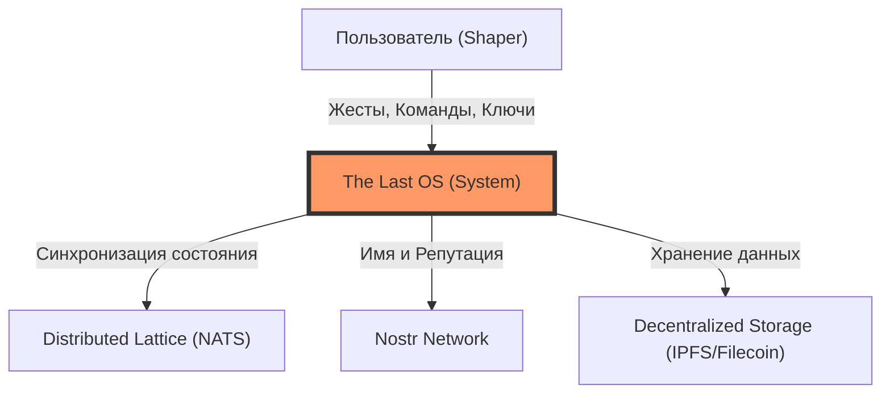
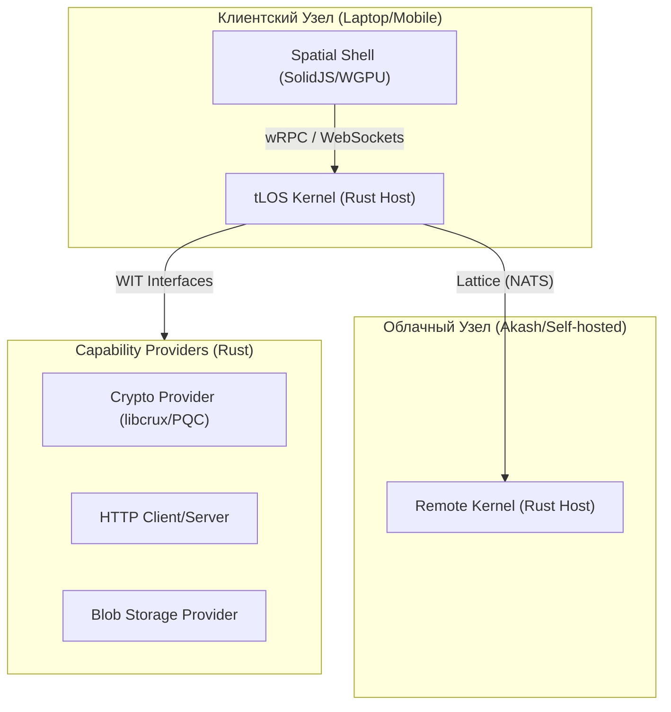

# System Architecture: The Last OS (C4 Model)

Этот документ описывает архитектуру **The Last OS (tLOS)** с использованием адаптированной модели **C4 (Context, Container, Component)**. Учитывая децентрализованную природу проекта, мы делаем упор на взаимодействие актёров (Wasm) и распределённую сеть (Lattice).

---

## 1. Уровень 1: Системный Контекст (System Context)
tLOS не является изолированной системой. Она взаимодействует с пользователем, криптографическими сетями и распределённой инфраструктурой обмена сообщениями.

---

## 2. Уровень 2: Контейнеры (Containers)
Контейнеры в tLOS — это независимые среды исполнения и провайдеры возможностей.

---

## 3. Уровень 3: Компоненты (Components — Actors)
На этом уровне мы рассматриваем внутреннюю логику "Актёров" — строительных блоков tLOS.

- **Shaper Actor**: Главный оркестратор. Управляет жизненным циклом других актёров и реагирует на системные события.
- **Spatial Actor**: Отвечает за квадродерево (Spatial Index) и расчёт видимости объектов для пользователя.
- **Identity Actor**: Управляет Nostr-ключами и подписью сообщений.

---

## 4. Почему C4? (Обоснование)
Исследование показало, что C4 обладает рядом преимуществ для tLOS:
1. **Масштабируемость**: Позволяет описывать как локальный запуск, так и глобальную "Латицу".
2. **Ясность для разработчиков**: Чёткое разделение на Host (Kernel) и Actors (Components) упрощает разработку на WIT.
3. **Визуализация Web3**: C2 идеально подходит для отображения взаимодействия с блокчейнами и децентрализованными хранилищами.

---
*Документация является живой и будет обновляться по мере реализации Layer 2 (Protocol).*
