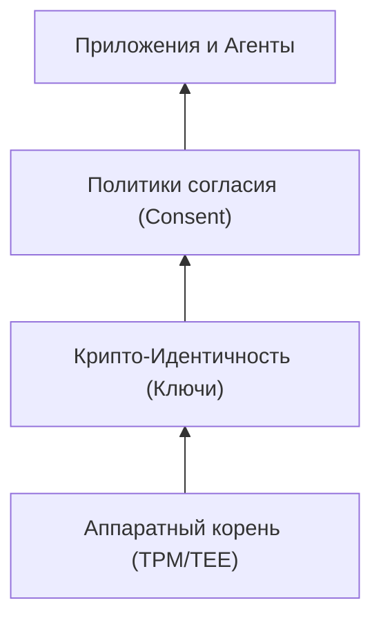
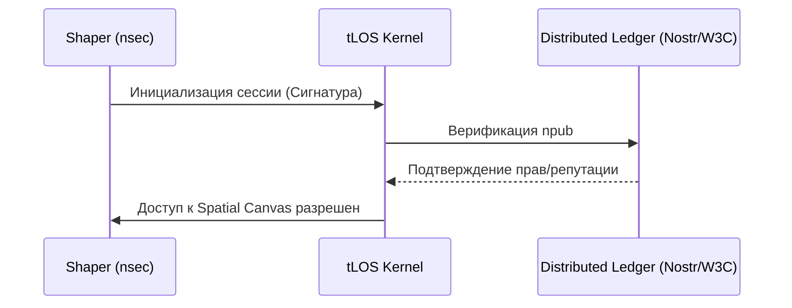

# The Sovereign Model: Identity as Key

Этот документ описывает идеологическую и техническую основу суверенности в **The Last OS (tLOS)**. Наша цель — превратить пользователя из "арендатора" цифрового пространства в полноправного "владельца", где ключи являются единственным источником истины и управления.

---

## 1. Концепция "Identity as Key"
В tLOS идентичность не является записью в базе данных. Это криптографический корень, из которого проистекают все права и данные.

### 1.1. Корень Доверия (Root of Trust)
Мы используем **Nostr-совместимые ключи (Schnorr/Ed25519)** в качестве первичного идентификатора.
- **Private Key (nsec)**: Ваше "Цифровое Я". Никогда не покидает защищенное хранилище (Secure Enclave / TPM).
- **Public Key (npub)**: Ваш глобальный адрес в Латице и Nostr-сетях.

### 1.2. Иерархия Ключей (Key Hierarchy)
Для безопасности мы разделяем полномочия:
1. **Master Key (Root)**: Хранится в оффлайне или аппаратном кошельке. Используется только для выпуска Subkeys.
2. **Device Keys (Operational)**: Уникальны для каждого устройства (Laptop, Phone). Подписывают ежедневные действия.
3. **Agent Keys (Scoped)**: Временные ключи, делегированные AI-агентам для выполнения специфических задач с ограниченными правами.

---

## 2. Модель Суверенности (Sovereignty Pyramid)
Мы визуализируем суверенность как пирамиду, где каждый верхний слой опирается на криптографическую честность нижнего.

---

## 3. Схема Взаимодействия (C4 Level 1: Context)
Как пользователь взаимодействует с системой через призму суверенности.

---

## 4. Спецификация Суверенных Данных
Данные в tLOS подчиняются трем правилам:
1. **Локальность по умолчанию**: Данные создаются и хранятся на устройстве пользователя.
2. **Шифрование "от края до края" (E2EE)**: При передаче через Латицу данные зашифрованы публичным ключом получателя (X25519).
3. **Отсутствие посредников**: Синхронизация происходит напрямую между узлами пользователя через NATS, без участия центрального сервера.

---

## 5. Соответствие стандартам (2026 Readiness)
tLOS проектируется с учетом:
- **W3C Decentralized Identifiers (DIDs)**: Мы поддерживаем метод `did:nostr`.
- **Verifiable Credentials (VCs)**: Дипломы, доступы и репутация передаются в виде подписанных аттестаций.
- **NIST 800-63-4**: Соответствие высшим уровням аутентификации (AAL3) через использование аппаратных ключей.

---
*Ваша свобода закодирована в ваших ключах. Берегите их.*
